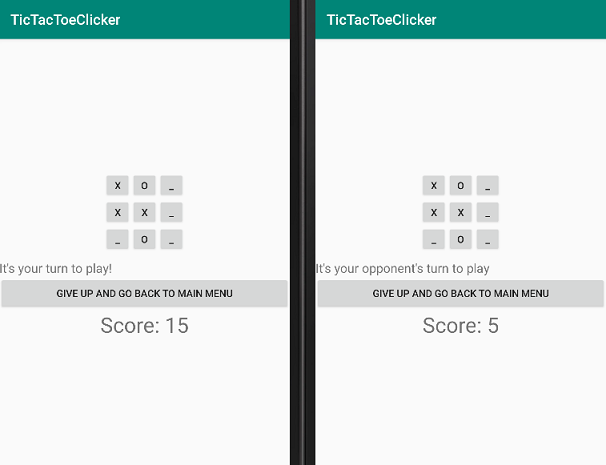
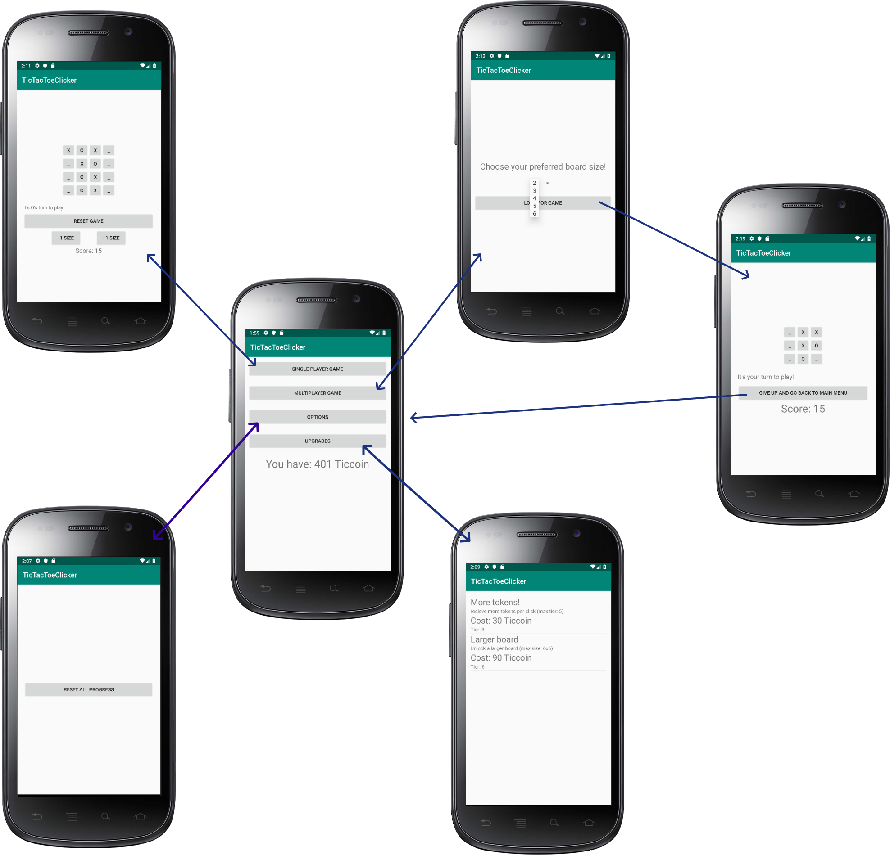

# REPORT.md

ClickTacToe, an online multiplayer Tic-Tac-Toe cookieclicker

### intro

Everyone has played Tic Tac Toe some time in their life: A simple 3-in-a-row turn based game which mostly ends in a draw.

This app is designed to incorporate a 'cookieclicker' type game with tic-tac-toetsenbord

A cookieclicker game is a type of incremental game, where the user perfomrs a simple task "clicking a cookie" to recieve tokens, which in turn are used to buy upgrades to recieve more tokens.

Thus, every time a tic-tac-toe tile is clicked, the player recieves "Ticcoin", which can be used to buy upgrades.

The app also implements a REST server for multiplayer gaming.

## Technical design:

### Classes:

* MainActivity: The main activity to go to the different activities
    * *Implements:*
    * UpgradeDatabase: pass around data using intents
    * PlayerDatabase: pass around data using intents, display amount of Ticcoin
* OptionsActivity: A button to reset all progress (go back to 0 Ticcoin and no upgrades)
* UpgradeActivity: A ListView of all available upgrades
    * *Implements:*
    * UpgradeDatabase: Retrieve upgrades and calculate the cost, adjust if an upgrade is bought
    * PlayerDatabase: Retrieve and adjust amount of Ticcoin
    * UpgradeAdapter: Display upgrades properly
* SinglePlayerActivity: play a single player game
    * *Implements:*
    * TicTacToeMatrix: a matrix class to handle x, y coordinates
    * TicTacToeGame: performs basic operations to play a tic-tac-toe game
    * PlayerDatabase: update amount of Ticcoin
* MultiplayerStartGameActivity: Initialize a multiplayer game and send requests to the server
    * *implements:*
    * PlayerDatabase: To retrieve the unique player id
    * GameRequest: Send and receive game requests
    * MainActivity: recieve intent for maximum board size
* MultiplayerActivity: The multiplayer version of the single player game
    * *Implements:*
    * MultiplayerStartGameActivity: receive game ID and starting player from intent
    * MoveRequest: post and request the next move
    * TicTacToeGame, TicTacToeMatrix, PlayerDatabase: same as in Single player
* PlayerDatabase, UpgradeDatabase: classes to handle player info (ID, Ticcoin) or upgrade info (name, cost, tier)
* TicTacToeMatrix, TicTacToeGame: classes to handle a tic-tac-toe game and matrix

### Challenges met:

- Changed multiplayer into 2 screens because it makes it easier to make a customized game request
- The biggest challenge was to not implement more upgrades, due to time constraints.
    - More implementations include: A bot to play against, a random chance of getting another turn, receive Ticcoin while idle, cosmetic upgrades. Given more time most of these would be implemented, especially the AI, so the player can play versus one in case of a multiplayer game timeout. Cosmetic upgrades are also a fun addition and would require 2 extra columns in the PlayerDatabase.
- Implementation of the server: There were multiple options and I was thinking too far ahead.
    - Decisions about the server style can be found in 'multiplayer ideen.txt'. Now that I learned about long polling and socket.io, it would be the ideal solution, though this REST server is also working properly.
    - An idea that was dropped was the online matchmaking, partly due to redundancy (most of the games end in a draw anyway), and difficulty in server implementation (thinking of a proper matchmaking function, etc.) In case this app is the new flappy bird, I'll consider adding it.
- Reading other people's code was a big challenge, as the old code was janky and badly implemented, most of the code is still intact though, out of fear I break the whole game down.
    - For example, some functions just return a call to another function. There was also no proper 'draw' game state. However, I implemented the code anyway to focus on other parts of the app. Given more time I would have refactored the code as a whole.
- As I have no sense of aestheticism, the app still looks basic
    - I am a very technical person and have no idea what style is ;)

All in all considered the project is *in my opinion* a solid scaffold to expand the app upon.
